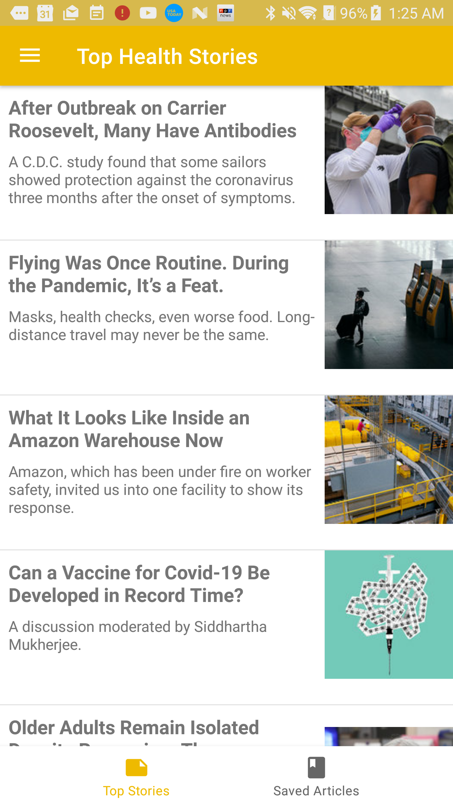
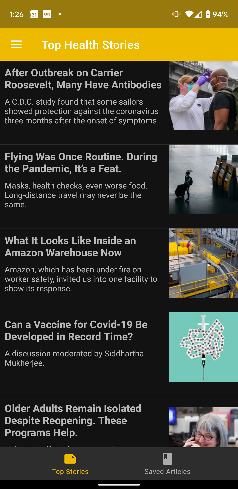

## Healthy Living Android App
---

### Functionality
This app will show the Top Stories from The New York Times Health section. The data feed is updated throughout the day.

From the main screen of the application the user can choose to view the Top Stories, or Saved Stories.
The top stories are dispalyed in a RecyclerView showing the Title, Summary (abstract) and thumbnail image from the article.

From this main screen the user can select an article and view it via an in-app browser. This screen will also all user to share or save the article.

If the user decides to save the article, it will be persisted in an sqlte database to be viewed later.

Inside the Navigation Drawer there a user has the ability to navigate to the "About the app" screen.

The app has support for Light/Dark themes via Materal Design themes and styles


### Purpose
 This app was created to demonstrate use of various Android Architecture Components and open source libraries. 


 ### Building & install

 #### Android Studio
Simply open the project in Android Studio and run the application


 #### Command line
 Use the gradle command below to build and install the application
 ``` shell
 $ ./gradlew installDebug
 ```

 If you wish to use your own API key, and not the one provided in the application, you can override it w/ the following command:

 ``` shell
 $ ./gradlew -Papikey.nyt="secretkey" installDebug
 ```

or you can optionally replace the key stored in: `gradle.properties`


Components and libraries used:

- Android Architecture Components used
  - Data Binding
  - Lifecycle
  - LiveData
  - Room
  - ViewModel
  - Navigation Component
* Open source libraries
  - Flipper - debugging
  - Glide - image loading
  - Koin - dependency injection
  - Material Design - design and style components
  - Moshi - JSON processing
  - Retrofit & OkHttp - HTTP / API network access
* Kotlin
  - Coroutines - Reactive
  

### Screen shots
Light | Dark
------------ | -------------
 |  
